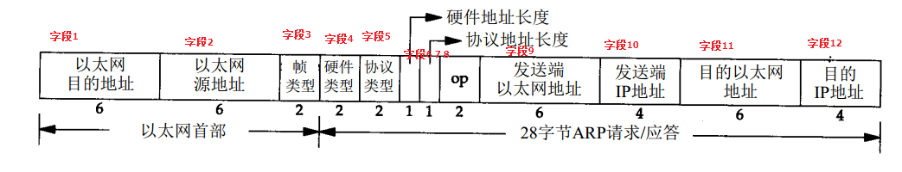

# TCP/IP协议——ARP详解

本文主要讲述了ARP的作用、ARP分组格式、ARP高速缓存、免费ARP和代理ARP。

## 1.学习ARP前要了解的内容

### 建立TCP连接与ARP的关系

应用接受用户提交的数据，触发TCP建立连接，TCP的第一个SYN报文通过connect函数到达IP层，IP层通过查询路由表：

　　如果目的IP和自己在同一个网段：

　　当IP层的ARP高速缓存表中存在目的IP对应的MAC地址时，则调用网络接口send函数（参数为IP Packet和目的MAC））将数据提交给网络接口，网络接口完成Ethernet Header + IP + CRC的封装，并发送出去；

　　当IP层的ARP高速缓存表中不存在目的IP对应的MAC地址时，则IP层将TCP的SYN缓存下来，发送ARP广播请求目的IP的MAC，收到ARP应答之后，将应答之中的<IP地址，对应的MAC>对缓存在本地ARP高速缓存表中，然后完成TCP SYN的IP封装，调用网络接口send函数（参数为IP Packet和目的MAC））将数据提交给网络接口，网络接口完成Ethernet Header + IP + CRC的封装，并发送出去；。

　　如果目的IP地址和自己不在同一个网段，就需要将包发送给默认网关，这需要知道默认网关的MAC地址：

　　当IP层的ARP高速缓存表中存在默认网关对应的MAC地址时，则调用网络接口send函数（参数为IP Packet和默认网关的MAC）将数据提交给网络接口，网络接口完成Ethernet Header + IP + CRC

　　当IP层的ARP高速缓存表中不存在默认网关对应的MAC地址时，则IP层将TCP的SYN缓存下来，发送ARP广播请求默认网关的MAC，收到ARP应答之后，将应答之中的<默认网关地址，对应的MAC>对缓存在本地ARP高速缓存表中，然后完成TCP SYN的IP封装，调用网络接口send函数（参数为IP Packet和默认网关的MAC）将数据提交给网络接口，网络接口完成Ethernet Header + IP + CRC的封装，并发送出去。

### ARP的位置

　　OSI模型有七层，TCP在第4层传输层，IP在第3层网络层，而ARP在第2层数据链路层。高层对低层是有强依赖的，所以TCP的建立前要进行ARP的请求和应答。

　　ARP高速缓存表在IP层使用。如果每次建立TCP连接都发送ARP请求，会降低效率，因此在主机、交换机、路由器上都会有ARP缓存表。建立TCP连接时先查询ARP缓存表，如果有效，直接读取ARP表项的内容进行第二层数据包的发送；只有表失效时才进行ARP请求和应答进行MAC地址的获取，以建立TCP连接。

### ARP的作用

　　要了解ARP的作用，首先要分清两个“地址”：

　　（1）TCP/IP的32bit IP地址。仅知道主机的IP地址不能让内核发送数据帧给主机。

　　（2）网络接口的硬件地址，它是一个48bit的值，用来标识不同的以太网或令牌环网络接口。在硬件层次上，进行数据交换必须有正确的接口地址，内核必须知道目的端的硬件地址才能发送数据。

　　简言之，就是在以太网中，一台主机要把数据帧发送到同一局域网上的另一台主机时，设备驱动程序必须知道以太网地址才能发送数据。而我们只知道IP地址，这时就需要采用ARP协议将IP地址映射为以太网地址。

　　要注意一点，一般认为ARP协议只使适用于局域网。

## 2.ARP分组格式

　　ARP分组的格式如下图：

 

　　先要清楚，一般说**以太网地址就是指MAC地址**。

　　字段1是ARP请求的目的以太网地址，全1时代表广播地址。

　　字段2是发送ARP请求的以太网地址。

　　字段3以太网帧类型表示的是后面的数据类型，ARP请求和ARP应答这个值为0x0806。

　　字段4表示硬件地址的类型，硬件地址不只以太网一种，是以太网类型时此值为1。

　　字段5表示要映射的协议地址的类型，要对IPv4地址进行映射，此值为0x0800。

　　字段6和7表示硬件地址长度和协议地址长度，MAC地址占6字节，IP地址占4字节。

　　字段8是操作类型字段，值为1，表示进行ARP请求；值为2，表示进行ARP应答；值为3，表示进行RARP请求；值为4，表示进行RARP应答。

　　字段9是发送端ARP请求或应答的硬件地址，这里是以太网地址，和字段2相同。

　　字段10是发送ARP请求或应答的IP地址。

　　字段11和12是目的端的硬件地址和协议地址。

 

下面是抓取的ARP数据包，可以对照上面的说明进行理解。

图中红框圈起来的是一对ARP请求和ARP应答。

 

下面两张图分别是ARP请求和相应的ARP应答的分组格式截图。

 

　　ARP请求分组中，字段11目的MAC地址未知，用全0进行填充。

 

ARP应答分组中，将ARP请求中的源和目的地址进行交换，此外，变化的还有字段8 Opcode。其余字段内容不会发生变化。

那么我们是如何区分ARP请求和ARP应答分组的呢？

　　分组中的地址字段和其他相同的字段无法作为区分依据，这时Opcode字段就发挥了作用，根据Opcode的值可以确定是请求还是应答，是ARP还是RARP。

 

## 3.ARP高速缓存

定义

　　ARP缓存是一个缓冲区，用来储存IP地址和MAC地址，本质就是<IP地址，MAC地址>的对应表。表中一个条目记录了网络上一个主机的IP地址和其对应的MAC地址。

　　每一个以太网或令牌环网络适配器都有自己单独的表。

　　当地址解析协议被询问一个已知IP地址节点的MAC地址时，先在ARP缓存中查看，若存在，就直接返回与之对应的MAC地址，若不存在，才发送ARP请求向局域网查询。

ARP缓存表项的生存时间TTL

　　ARP缓存包含动态和静态项目：

　　动态项目随时间推移自动添加和删除，每个动态ARP缓存项都有都设置了TTL(生存时间)，TTL为0时此项目就从表中删除，Windows下TTL一般不超过10分钟。

　　静态 ARP 缓存条目是永久性的，可以使用 TCP/IP 工具手动添加和删除。静态 ARP 缓存条目用来禁止节点发送对常用的本地IPv4地址（例如路由器和服务器的 IPv4 地址）的ARP请求。

ARP高速缓存的使用

　　当主机发送一个ARP请求时，先查看ARP高速缓存表，如果存在对应条目，则直接返回MAC地址，否则向局域网发送ARP请求广播。

ARP高速缓存的优缺点

　　优点：从ARP高速缓存的使用中可以看到，ARP高速缓存可以减小广播量，进而减小网络通信量，提高计算机之间的通信效率。

　　缺点：造成安全隐患（参考下面免费ARP的作用）。

## 4.免费ARP

定义

　　免费ARP指主机发送ARP查找自己的IP地址，通常发生在系统引导期间进行接口配置时。

　　与标准ARP的区别就是免费ARP分组的目的IP地址字段封装的是自己的IP地址，即向所在网络请求自己的MAC地址。

作用　

　　免费ARP的作用有：
　　1) 一个主机可以通过它来确定另一个主机是否设置了相同的 IP地址。

　　　正常情况下发送免费ARP请求不会收到ARP应答，如果收到了一个ARP应答，则说明网络中存在与本机相同的IP地址的主机，发生了地址冲突。

　　2)更新其他主机高速缓存中旧的硬件地址进行。

　　　如果发送免费ARP的主机正好改变了硬件地址，如更换了接口卡。

　　　其他主机接收到这个ARP请求的时候，发现自己的ARP高速缓存表中存在对应的IP地址，但是MAC地址不匹配，那么就需要利用接收的ARP请求来更新本地的ARP高速缓存表表项。

　　3)网关利用免费ARP防止ARP攻击

　　有些网关设备在一定的时间间隔内向网络主动发送免费ARP报文，让网络内的其他主机更新ARP表项中的网关MAC地址信息，以达到防止或缓解ARP攻击的效果。

　　4)利用免费ARP进行ARP攻击

　　ARP协议并不只在发送了ARP请求才接收ARP应答，计算机只要接收到ARP应答数据包，就会使用应答中的IP和MAC地址对本地的ARP缓存进行更新。

　　主机可以构造虚假的免费ARP应答，将ARP的源MAC地址设为错误的MAC地址，并把这个虚假的免费ARP应答发送到网络中，那么所有接收到这个免费ARP应答的主机都会更新本地ARP表项中相应IP地址对应的MAC地址。更新成功后，这些主机的数据报文就会被转发到错误的MAC地址，从而实现了ARP欺骗的攻击。

 

## 5.代理ARP

定义

　　代理ARP就是通过使用一个主机(通常为router)，来作为指定的设备使用自己的 MAC 地址来对另一设备的ARP请求作出应答。

为什么需要代理ARP？

　　先要了解，路由器的重要功能之一就是把局域网的广播包限制在该网内，阻止其扩散，否则会造成网络风暴。

　　ARP请求是个广播包，它询问的对象如果在同一个局域网内，就会收到应答。但是如果询问的对象不在同一个局域网该如何处理？路由器就提供的代理ARP为这个问题提供了解决方案。

工作过程

　　两台主机A和B处于同一网段但不同的广播段时，主机A发送ARP请求主机B的MAC地址时，因为路由器不转发广播包的原因，ARP请求只能到达路由器。如果路由器启用了代理ARP功能，并知道主机B属于它连接的网络，那么路由器就用自己接口的MAC地址代替主机B的MAC地址来对主机A进行ARP应答。主机A接收ARP应答，但并不知道代理ARP的存在。

代理ARP的优缺点

　　优点：代理ARP能在不影响路由表的情况下添加一个新的Router，使子网对该主机变得透明化。一般代理ARP应该使用在主机没有配置默认网关或没有任何路由策略的网络上。

　　缺点：从工作工程可以看到，这其实是一种ARP欺骗。而且，通过两个物理网络之间的路由器的代理ARP功能其实互相隐藏了物理网络，这导致无法对网络拓扑进行网络概括。此外，代理ARP增加了使用它的那段网络的ARP流量，主机需要更大的ARP缓存空间，也不会为不使用ARP进行地址解析的网络工作。

[TCP/IP协议——ARP详解](https://www.cnblogs.com/songwenlong/p/6103406.html)

